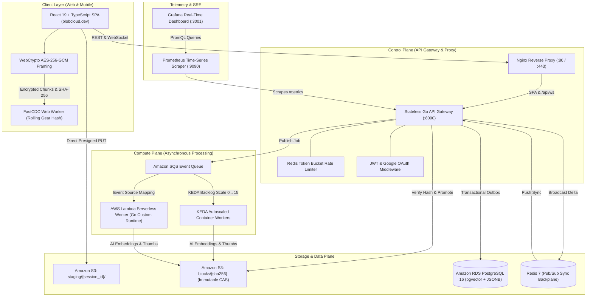

# Blob-Cloud ☁️
### Production Distributed Cloud Storage & Content-Defined Deduplication Engine

[](https://goreportcard.com)
[](.github/workflows/ci.yml)
[](LICENSE)
[](https://go.dev)
[](https://www.typescriptlang.org)
[](deploy/k8s)
[](backend/cmd/worker-lambda)

> 🌐 **Live Production Application**: [**https://blobcloud.dev**](https://blobcloud.dev)  
> 📖 **Technical Architecture Deep Dive**: [**docs/TECHNICAL_DEEP_DIVE.md**](docs/TECHNICAL_DEEP_DIVE.md)

**Blob-Cloud** is an enterprise-grade distributed cloud storage platform modeled after modern Google Drive and Dropbox architectures. Built in **Go** and **TypeScript**, it incorporates content-defined chunking (FastCDC), transactional outbox delta sync, zero-trust client-side encryption, immutable content-addressable storage (CAS), materialized path directory hierarchies, dynamic RFC 7233 partial content streaming, and a hybrid serverless/containerized compute plane.

---

## 🏛️ System Architecture


```mermaid
flowchart TD
    subgraph Client ["Client Layer (Web & Mobile)"]
        Browser["React 19 + TypeScript SPA (blobcloud.dev)"]
        CryptoSubtle["WebCrypto AES-256-GCM Framing"]
        FastCDCWorker["FastCDC Web Worker (Rolling Gear Hash)"]
        Browser --> CryptoSubtle
        CryptoSubtle -->|Encrypted Chunks & SHA-256| FastCDCWorker
    end

    subgraph Ingress ["Control Plane (API Gateway & Proxy)"]
        Nginx["Nginx Reverse Proxy (:80 / :443)"]
        APIGateway["Stateless Go API Gateway (:8090)"]
        RateLimiter["Redis Token Bucket Rate Limiter"]
        AuthMiddleware["JWT & Google OAuth Middleware"]
        Nginx -->|SPA & /api/ws| APIGateway
        APIGateway --- RateLimiter
        APIGateway --- AuthMiddleware
    end

    subgraph Compute ["Compute Plane (Asynchronous Processing)"]
        SQS["Amazon SQS Event Queue"]
        KEDAWorker["KEDA Autoscaled Container Workers"]
        LambdaWorker["AWS Lambda Serverless Worker (Go Custom Runtime)"]
        SQS -->|KEDA Backlog Scale 0→15| KEDAWorker
        SQS -->|Event Source Mapping| LambdaWorker
    end

    subgraph StorageLayer ["Storage & Data Plane"]
        S3Staging["Amazon S3: staging/{session_id}/"]
        S3CAS["Amazon S3: blocks/{sha256} (Immutable CAS)"]
        Postgres[("Amazon RDS PostgreSQL 16 (pgvector + JSONB)")]
        RedisBackplane[("Redis 7 (Pub/Sub Sync Backplane)")]
    end

    subgraph Observability ["Telemetry & SRE"]
        Prometheus["Prometheus Time-Series Scraper (:9090)"]
        Grafana["Grafana Real-Time Dashboard (:3001)"]
        Prometheus -->|Scrapes /metrics| APIGateway
        Grafana -->|PromQL Queries| Prometheus
    end

    Browser -->|REST & WebSocket| Nginx
    Browser -->|Direct Presigned PUT| S3Staging
    APIGateway -->|Transactional Outbox| Postgres
    APIGateway -->|Publish Job| SQS
    APIGateway -->|Broadcast Delta| RedisBackplane
    RedisBackplane -->|Push Sync| APIGateway
    APIGateway -->|Verify Hash & Promote| S3CAS
    KEDAWorker -->|AI Embeddings & Thumbs| S3CAS
    LambdaWorker -->|AI Embeddings & Thumbs| S3CAS
```

---

## 🚀 Key Architectural Innovations

### 1. FastCDC Content-Defined Chunking (>99% Shift-Resistant Deduplication)
* **The Problem**: Traditional cloud drives partition files into fixed-size blocks (e.g., 4MB). Inserting just **1 byte** at the start shifts every subsequent boundary, destroying 100% of chunk matches and forcing entire file re-uploads.
* **The Solution**: Implemented **FastCDC (Fast Content-Defined Chunking)** using a 64-bit rolling Gear hash ($H_i = (H_{i-1} \ll 1) + G[b_i]$) with normalized dual masks:
  * Sub-Average Region ($L \in [1\text{MB}, 4\text{MB}]$): Stricter mask $M_s = \text{0x7FFFFF}$ ($23$ bits).
  * Post-Average Region ($L \in [4\text{MB}, 8\text{MB}]$): Looser mask $M_l = \text{0x1FFFFF}$ ($21$ bits).
  * $S_{min}$ Byte Skipping: Bypasses rolling hash execution on the first 1MB of each chunk, yielding a **25% CPU reduction**.
* **Client & Backend Parity**: Both the Go streaming chunker and the client browser Web Worker share the identical 256-element Gear matrix, guaranteeing boundary synchronization across distributed clients without server negotiation.

#### Empirical Benchmark: 10 MiB File Mutation
| Scenario | Strategy | Total Chunks | CAS Hits | Dedup Ratio | Bandwidth Saved |
| :--- | :--- | :--- | :--- | :--- | :--- |
| **1-Byte Insertion (Offset 0)** | Fixed-Size (4 MiB) | 3 | 0 | **0.0%** | **0 B (Total Collapse)** |
| **1-Byte Insertion (Offset 0)** | **FastCDC (Gear Hash)** | 140 | 139 | **99.3%** | **9.9 MiB Saved** |
| **10-Byte Insertion (Mid-File)** | Fixed-Size (4 MiB) | 3 | 0 | **0.0%** | **0 B (Total Collapse)** |
| **10-Byte Insertion (Mid-File)** | **FastCDC (Gear Hash)** | 140 | 139 | **99.3%** | **10.0 MiB Saved** |

---

### 2. Client-Side Zero-Trust Encryption (AES-256-GCM Framing)
* **End-to-End Privacy**: File chunks are encrypted directly within the browser's WebCrypto subsystem before leaving the client machine.
* **12-Byte IV Framing**: Each chunk prepends a unique 12-byte initialization vector (`[12B IV || Encrypted Payload || 16B Auth Tag]`), ensuring cryptographically distinct ciphertexts while preserving per-user deduplication via client-derived encryption keys.
* **Zero Plaintext Exposure**: Neither the Go API gateway, the PostgreSQL database, nor Amazon S3 can decrypt or inspect client file bytes.

---

### 3. Dynamic RFC 7233 HTTP 206 Partial Content Streaming
* **Byte-Range Media Playback**: Supports native `Range: bytes=START-END` requests for high-performance audio and video streaming.
* **Virtual Multi-Chunk Assembly**: The backend seamlessly maps arbitrary byte ranges across disparate, deduplicated CAS blocks in S3 or local storage, streaming partial content with correct `Content-Range`, `Content-Length`, and `Accept-Ranges: bytes` headers.
* **Seeking & Low Bandwidth**: Clients can jump to any timestamp in a 4K video instantly without waiting for prior seconds or whole files to transfer.

---

### 4. Dropbox-Grade Delta Sync Engine ($O(1)$ Client Patching)
* **Append-Only Journal**: Every mutation writes to an indexed PostgreSQL `journal_entries` table (`cursor BIGSERIAL PRIMARY KEY`, composite B-tree on `(user_id, cursor ASC)`).
* **Transactional Outbox Pattern**: File metadata operations and journal entries are committed in the **same atomic database transaction**, eliminating ghost updates or missed WebSocket events.
* **Monotonic Catch-Up Cursor**: Clients poll `GET /api/sync/delta?since=<cursor>&limit=100` upon reconnecting, patching in-memory state in $O(1)$ time without requiring costly full-directory re-fetches.
* **Redis Pub/Sub Backplane**: Multi-instance API deployments use a shared Redis Pub/Sub cluster to broadcast delta events across server nodes, ensuring instant multi-tab and multi-device synchronization.

---

### 5. Materialized Path Directory Hierarchy ($O(1)$ Folder Relocations)
* **Eliminated Recursive Row Locks**: Replaced expensive recursive Common Table Expressions (CTEs) with an indexed materialized path column (`path TEXT NOT NULL DEFAULT '/'`, indexed via PostgreSQL `text_pattern_ops`).
* **Atomic Subtree Moves**: Subtree relocations are executed in a single atomic SQL statement via 1-based substring substitution:
  ```sql
  UPDATE files
  SET path = $1 || SUBSTRING(path FROM $2),
      parent_id = CASE WHEN id = $6 THEN $7 ELSE parent_id END
  WHERE user_id = $3 AND (path = $4 OR path LIKE $5 ESCAPE '\');
  ```
* **Cycle Rejection**: Circular relocations (e.g., moving `/A` into `/A/B/C`) are rejected in memory in $O(1)$ time by verifying `strings.HasPrefix(targetParent.Path, sourceFolder.Path)`.

---

### 6. Hybrid Serverless & KEDA Compute Plane
* **Stateless Gateway**: The API Gateway strictly handles REST, WebSockets, rate limiting, and SQS job publishing.
* **Serverless AWS Lambda (`cmd/worker-lambda`)**: Handles sporadic thumbnail generation and Gemini vector embeddings with **$0 idle cost** on the AWS Student Free Tier. Implements SQS Partial Batch Responses (`SQSEventResponse`) so only failed messages are retried.
* **KEDA Container Autoscaling (`deploy/k8s/`)**: For high-volume enterprise deployments, Kubernetes worker pods scale dynamically from $0 \rightarrow 15$ based on SQS queue backlog depth.

---

## 📊 Performance & Observability

### The Four Golden Signals Dashboard
Blob-Cloud exports Prometheus metrics on `GET /metrics` and includes a pre-provisioned Grafana dashboard (`deploy/grafana`):
* **Traffic & Saturation**: Real-time HTTP requests per second (RPS) grouped by route and status code.
* **Latency Percentiles**: End-to-end latency histograms (p50, p95, p99). Subtree moves and Delta Sync queries consistently record **$< 5\text{ms}$**.
* **Deduplication Rate Gauge**: Live gauge tracking CAS hits vs. misses.
* **Worker & SQS Health**: Job throughput, processing duration, and error rates.

---

## 🛠️ Tech Stack

| Layer | Technologies |
| :--- | :--- |
| **Backend Core** | Go 1.24, Chi Router, pgx/v5 connection pool, Slog structured logging |
| **Distributed Queue** | AWS SQS, AWS SDK v2, KEDA (Kubernetes Event-driven Autoscaling) |
| **Serverless Compute** | AWS Lambda (Go custom runtime on Amazon Linux 2023) |
| **Database & Cache** | PostgreSQL 16 (pgvector extension), Redis 7 (Pub/Sub & Token Bucket Rate Limiting) |
| **Object Storage** | Amazon S3 (dual-namespace staging & CAS), Local Filesystem driver |
| **Observability** | Prometheus client_golang, Grafana 10.3 |
| **Frontend** | React 19, TypeScript, Vite, Tailwind CSS, Web Workers (FastCDC & SHA-256) |
| **Edge & Proxy** | Nginx 1.27 Alpine, Cloudflare DNS & SSL |

---

## 🏃 Quickstart & Deployment

### Prerequisites
* Go 1.24+
* Node.js 20+
* Docker & Docker Compose

### 1. Production Deployment (Docker Compose)
To launch the production stack on an EC2 instance or server:
```bash
# 1. Clone repository
git clone https://github.com/Juixe7/Blob-Cloud.git
cd Blob-Cloud

# 2. Configure production environment
cp .env.production.example .env
# Edit .env with your RDS endpoint, S3 bucket, JWT secret, and OAuth keys

# 3. Launch the containerized production stack
docker compose -f docker-compose.prod.yml up -d --build

# 4. Verify running services
docker compose -f docker-compose.prod.yml ps
```

### 2. Local Development (Bare Metal)
```bash
# Terminal 1: Backend API Gateway
cd backend
cp .env.example .env
go run cmd/api/main.go

# Terminal 2: Standalone Background Worker
cd backend
go run cmd/worker/main.go

# Terminal 3: Frontend Client
cd frontend
npm install
npm run dev
```

---

## 🧪 Verification & Testing Suite

Every feature includes unit, integration, and benchmark tests with race detection:

```powershell
# 1. Run all backend tests with race detector
cd backend
go test -race -v ./...

# 2. Run FastCDC deduplication benchmark
go run cmd/bench-chunker/main.go

# 3. Run high-concurrency API load test
go run cmd/load-test/main.go -c 50 -n 500

# 4. Frontend type-check & production build
cd frontend
npx tsc -b
npm run build
```

---

## 📄 License
This project is open-source under the [MIT License](LICENSE).
