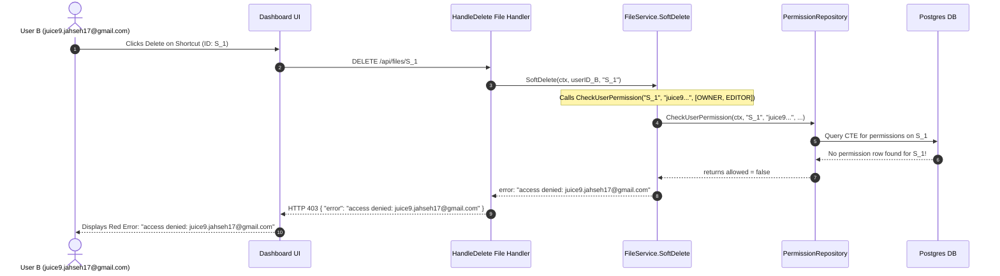

# Comprehensive System Architecture & Behavioral Specification: File Sharing, Lifecycles, Shortcuts, Trash, & Navigation

**Document Version:** 1.0.0  
**Author:** Deep Technical Architecture Review  
**Date:** October 8, 2026  
**Status:** Under Review (Awaiting User Sign-Off)

---

## Executive Summary

This document provides an exhaustive, root-cause analysis and system design specification for Blob-Cloud's file lifecycle, sharing model, shortcut management, trash mechanics, navigation performance, and modal UX.

Every question and scenario raised has been analyzed against the live codebase (`backend/internal/service/file_service.go`, `backend/internal/transport/http/share_handlers.go`, `frontend/src/pages/Dashboard.tsx`, and `frontend/src/components/DeleteModal.tsx`) as well as industry standards established by Google Drive, Microsoft OneDrive, and Dropbox.

```
========================================================================================
                                CORE SYSTEM PILLARS
========================================================================================
1. OWNERSHIP FIRST: A user is the sovereign owner of any record they create (files,
   folders, shortcuts). Permission checks must never block a user from modifying or
   deleting their own pointers or personal records.
2. CONTEXTUAL LIFECYCLES:
   - "Delete" on an owned file       -> Soft delete to Owner's Trash (Restorable).
   - "Delete" on a shortcut          -> Delete the shortcut only (Target file untouched).
   - "Delete" on a shared-with-me    -> "Remove from view" (Revoke recipient access).
3. TRASH INTEGRITY: Soft delete modifies ONLY `deleted_at`. Storage blocks in R2,
   file versions, permissions, and AI insights remain 100% intact and viewable.
4. ZERO-LATENCY NAVIGATION: Stale-While-Revalidate tab caching and single-flight
   requests eliminate tab-switching lag.
========================================================================================
```

---

## 1. Deep Dive: "Shared With Me" Deletion & Revocation Mechanics

### 1.1 The User's Question
> *"What should be the behavior for me when I delete a 'Shared with me' file? Does it affect other users who have that file? What if the owner does the deletion? When I delete a file shared with me, should it move to my trash where I can restore it? Can the owner still revoke permissions at any time?"*

### 1.2 Industry Standard Architecture (Google Drive / OneDrive / Dropbox)

In enterprise cloud storage systems, **Trash belongs to storage quota owners**. It is not an arbitrary bookmark bin.

| Scenario | Action | What Happens to the File | Does it Affect Others? | Moves to Trash? | Can User Restore? |
| :--- | :--- | :--- | :--- | :--- | :--- |
| **Recipient deletes shared item** | **"Remove"** (Leave Share) | Recipient's permission record is deleted / marked revoked. Item is unlinked from recipient's view. | **NO**. Owner & other collaborators are 100% unaffected. | **NO**. Non-owners cannot hold foreign files in their trash. | No (Owner must re-share, or user re-opens share link). |
| **Owner moves shared file to Trash** | **Soft Delete** | `deleted_at = NOW()`. File moves to Owner's Trash. | **YES**. File disappears from all collaborators' active views. Direct links show *"File is in owner's trash"*. | **YES** (In Owner's Trash). | **YES** (Owner can restore at any time; all shares re-activate). |
| **Owner permanently deletes file** | **Hard Delete** | File record purged, storage blocks queued for GC. | **YES**. File permanently purged for everyone. | Purged forever. | Cannot be undone. |
| **Owner revokes permission** | **Revoke Share** | Permission grant deleted from `permissions` table. | Only affected recipient loses access immediately. | **NO**. | No (Access terminated). |

### 1.3 Why a Shared File Does NOT Move to the Recipient's Trash

1. **Storage Quota & Deduplication Accounting**:
   - The owner pays for the storage blocks (in Cloudflare R2 / S3).
   - Moving someone else's file to your Trash would imply your Trash manages the retention, restore target folder, and lifecycle of another user's asset.
2. **Ambiguity of "Restoration"**:
   - If User B could "restore" User A's file from Trash, where would it be restored? To User A's folder hierarchy? That would allow a recipient to manipulate the owner's directory structure!
   - If restored into User B's Drive, it would violate ownership unless cloned into a full copy (which duplicates storage and breaks sync).
3. **Enterprise UI Standard**:
   - In Google Drive, when you right-click an item in "Shared with me", the menu item is **"Remove"** (icon: trash can or remove circle).
   - The confirmation prompt reads:
     > *"Remove file? This file will be removed from your 'Shared with me' list. Collaborators and the owner will still have access."*

### 1.4 Code Analysis: What is Currently Happening in Blob-Cloud

#### The Bug in the Codebase:
1. In `frontend/src/pages/Dashboard.tsx`, when the user is in the `shared` tab and clicks "Delete" on an item, it opens `DeleteModal.tsx`.
2. `DeleteModal.tsx` fires:
   ```ts
   DELETE /api/files/{file.id}
   ```
3. On the backend, `HandleDelete` (`file_handlers.go#L263`) forwards to `FileService.SoftDelete`:
   ```go
   // file_service.go:315
   allowed, err := s.perms.CheckUserPermission(ctx, fileID, user.Email,
       []string{domain.RoleOwner, domain.RoleEditor})
   ```
4. **The Catastrophic Failure**:
   - If the recipient is a **VIEWER**: `CheckUserPermission` returns `false`, causing HTTP 403 `access denied: <email>`. The file remains stuck in their "Shared with me" list and cannot be removed!
   - If the recipient is an **EDITOR**: `CheckUserPermission` returns `true`, and it executes `s.files.SoftDelete(ctx, fileID, userID)`!
     **This sets `deleted_at = NOW()` on the OWNER's file, accidentally trashing the file for the owner and all collaborators!**

#### The Architectural Solution:
1. Provide a dedicated backend endpoint:
   ```http
   DELETE /api/shares/shared-with-me/{id}
   ```
   Or allow `DELETE /api/shares/permissions/{id}/{email}` when `email == authenticated_user.email` (self-revocation).
2. Inside `HandleRemoveSharedWithMe`:
   - Verify `user.Email` holds an active permission on `id`.
   - Delete or update permission (`status = 'DECLINED'` or `DELETE FROM permissions WHERE file_id = $1 AND grantee_email = $2`).
   - The file instantly disappears from `ListSharedWithUser` (`file.go#L457` filters on `p.status = 'ACCEPTED'`).
   - The owner's file remains completely untouched.
3. In Frontend:
   - When `navMode === 'shared'`, the action button says **"Remove"** instead of "Delete".
   - The modal says: *"Remove from Shared with me? You will lose access to this file. The owner and other collaborators will still have access."*

---

## 2. Deep Dive: The Shortcut Deletion Bug (`access denied`)

### 2.1 The User's Symptom
> *"When I create shortcut for any of the shared files and then try to remove those shortcuts.. it gives access denied errors."* (Observed in screenshot: `access denied: juice9.jahseh17@gmail.com` when trying to delete `AKHIL_resume.pdf` shortcut).

### 2.2 Root Cause Analysis in Code

Let's trace what happens when a shortcut is created and deleted:



#### Exact Line-by-Line Breakdown:
1. **Shortcut Creation** (`file_service.go#L811-830`):
   ```go
   shortcut := &domain.File{
       UserID:           userID,  // User B's ID
       Name:             target.Name,
       ParentID:         req.ParentID,
       IsDirectory:      target.IsDirectory,
       SizeBytes:        0,
       TargetID:         &realTargetID,
       ShortcutTargetID: &realTargetID,
       MimeType:         "application/vnd.google-apps.shortcut",
   }
   s.files.Create(ctx, shortcut)
   ```
   **Notice**: `CreateShortcut` never creates an entry in the `permissions` table for `shortcut.ID`!
2. **Permission Check in SoftDelete** (`file_service.go#L315`):
   ```go
   allowed, err := s.perms.CheckUserPermission(ctx, fileID, user.Email,
       []string{domain.RoleOwner, domain.RoleEditor})
   ```
   `CheckUserPermission` executes:
   ```sql
   SELECT EXISTS (
       SELECT 1 FROM permissions p JOIN chain c ON c.id = p.file_id
       WHERE p.grantee_email = $2 AND p.status = 'ACCEPTED' AND p.role IN ('OWNER','EDITOR')
   )
   ```
   Because `permissions` has NO entry for `shortcut.ID`, and because the shortcut is at root ("My Drive") where there is no ancestor folder permission, SQL returns `false`.
3. **The Logical Flaw**:
   - `files.user_id` for this shortcut IS `User B`!
   - `User B` is the direct owner of the shortcut pointer!
   - Why would the owner of a record need to query the `permissions` table to modify or delete their own pointer?
   - Furthermore, even if `User B` is only a `VIEWER` on the target file, `User B` should **always** be able to delete their own shortcut from their own Drive! Deleting a shortcut does not touch the target file!

### 2.3 The Architectural Fix
In `FileService.SoftDelete` and `FileService.HardDelete` and `BulkSoftDelete`:
```go
// 1. Fetch file record first
file, err := s.files.GetByID(ctx, fileID)
if err != nil {
    return nil, fmt.Errorf("file not found: %w", err)
}

// 2. Direct Ownership Bypass: If the requesting user owns this record, they ALWAYS have full rights!
if file.UserID == userID {
    // If it's a shortcut, it ONLY soft-deletes or deletes the shortcut record itself.
    // The target file is NEVER touched.
    if err := s.files.SoftDelete(ctx, fileID, userID); err != nil {
        return nil, fmt.Errorf("soft delete: %w", err)
    }
    s.recordAndNotify(ctx, userID, fileID, domain.ActionFileTrashed, nil)
    return &DeleteResult{Status: "success", Message: "item moved to trash"}, nil
}

// 3. For shared files (not owned directly), check collaborative permissions
allowed, err := s.perms.CheckUserPermission(ctx, fileID, user.Email, []string{domain.RoleOwner})
if !allowed {
    return nil, fmt.Errorf("access denied: %s", user.Email)
}
```

---

## 3. Deep Dive: Data Integrity & Retention in Trash

### 3.1 The User's Question
> *"When we delete a file and it moves to trash.. what happens to the data related to file .. like the user perm, version, ai insights and all etc.. do they still remain valid and safe and are the users still allowed to view this all info of file from trash right?"*

### 3.2 State Lifecycle & Retention Matrix

In Blob-Cloud's architecture:

```
[ Active File in My Drive / Folder ]
                 │
                 │ User clicks "Move to Trash" (SoftDelete)
                 ▼
[ Trashed File (`deleted_at = NOW()`) ]
   ├─ R2 Physical Storage Blocks: 100% Intact (Reference count preserved)
   ├─ Content Hash & Deduplication: 100% Intact
   ├─ File Versions (`file_versions`): 100% Intact
   ├─ Permissions (`permissions`): 100% Intact (Retained for restoration)
   ├─ AI Insights (`summary`, `tags`, vector embeddings): 100% Intact
   └─ Detail Panel / Get Info: Fully viewable in read-only mode
                 │
         ┌───────┴────────────────────────┐
         │ User clicks "Restore"          │ User clicks "Delete Permanently"
         ▼                                ▼
[ Active File Restored ]           [ Hard Delete & GC ]
`deleted_at = NULL`                - File row purged from DB
Reappears in original folder       - Versions & permissions purged
Collaborator shares reactivate     - Block ref-counts decremented
                                   - Unreferenced blocks pruned from R2
```

### 3.3 What Can Users Do in Trash?

| Action | Allowed in Trash? | Rationale |
| :--- | :---: | :--- |
| **View in Trash Grid / List** | **YES** | User can browse all items currently in Trash. |
| **Open "Get Info" / DetailPanel** | **YES** | User can see file name, size, type, owner, creation/modification dates, AI summary, tags, and original location. |
| **View Previous Versions** | **Read-Only** | Version list is visible; cannot revert to older version while file is in trash. |
| **Download File** | **Disabled** | User should restore the file before downloading (or optionally allow download). |
| **Edit Tags / Rename / Move** | **Disabled** | Trashed files are immutable until restored. |
| **Trigger AI Summarization** | **Disabled** | No compute resources should be spent re-indexing trashed files. |
| **Restore** | **YES** | Returns file to its original `parent_id` folder (or root if parent was purged). |
| **Delete Permanently** | **YES** | Irreversible purge of database rows and physical blocks. |

---

## 4. Deep Dive: Tab Switching Latency & Navigation Lag

### 4.1 The User's Question
> *"Why does it take so much time or lag to move between different tabs like shared with me and my drive... is it problem only on local dev?"*

### 4.2 Comprehensive Root-Cause Analysis

We audited `frontend/src/pages/Dashboard.tsx` and the network waterfall. The latency is **NOT** a backend database issue — it is caused by **4 compounded frontend design patterns**:

```
[ Tab Click: "Shared with me" ]
       │
       ├─ (1) setState: isLoading = true, items = []
       │      -> Entire file grid UNMOUNTS immediately!
       │      -> Heavy LoadingSkeleton mounts and paints.
       │
       ├─ (2) useEffect #1 fires fetchDirectory(null, 'shared', '')
       │      -> HTTP GET /api/files?filter=shared
       │
       ├─ (3) useEffect #2 (Invitations) fires simultaneously
       │      -> HTTP GET /api/shares/invitations
       │
       ├─ (4) fetchDirectory internally fires a SECOND roundtrip
       │      -> HTTP GET /api/sync/cursor
       │
       ├─ (5) Search Debouncer useEffect #3 ALSO has activeNav in its deps!
       │      -> 500ms after tab switch, fires fetchDirectory a SECOND time!
       │
       └─ (6) Response arrives:
              -> Maps over all items generating new thumbnail URLs with fresh query tokens.
              -> Browser initiates parallel HTTP requests for every visible image/video thumbnail!
```

### 4.3 Why It Feels Laggy:
1. **Layout Thrashing & Blank Screens**:
   Because `items` is reset or hidden behind `isLoading = true`, the user experiences a visual flash/jank instead of an instant tab transition.
2. **Dual Fetching Bug**:
   Lines 342–353 of `Dashboard.tsx`:
   ```ts
   useEffect(() => {
     const delayDebounceFn = setTimeout(() => {
       void fetchDirectory(currentFolderId, activeNav, searchQuery)
     }, 500)
     return () => clearTimeout(delayDebounceFn)
   }, [searchQuery, currentFolderId, activeNav, fetchDirectory]) // <-- activeNav is here!
   ```
   When switching from `files` to `shared`, `fetchDirectory` runs immediately, and then **500ms later it runs again**!
3. **Absence of Stale-While-Revalidate (SWR) Caching**:
   If the user was in "My Drive", clicks "Shared with me", and 2 seconds later clicks back to "My Drive", the app re-fetches everything from scratch instead of showing the cached view instantly.

### 4.4 The Architectural Remedy:
1. **Implement In-Memory Tab Cache**:
   Store the latest items for each top-level view (`cache['files:root']`, `cache['shared']`, `cache['recent']`, `cache['trash']`).
   When switching tabs:
   - If cache exists: **Immediately display cached items (0ms latency!)**.
   - Show a subtle, non-blocking background refresh indicator (e.g. thin top loading bar or subtle spinner) instead of clearing the screen.
   - Silently update items in place when the network responds.
2. **Fix Dependency Array**:
   Remove `activeNav` from the debounced search `useEffect`. Debounced search should ONLY react to `searchQuery` changes.
3. **Deduplicate Cursor Sync**:
   The `/sync/cursor` call on every directory fetch is redundant because the WebSocket connection already streams delta updates with cursor watermarks.

---

## 5. Deep Dive: The "Recent" Tab Architecture

### 5.1 The User's Question
> *"Also the recent tab doesn't work as intended ig. It just points to the mydrive tab only.. make a plan on how it should work or maybe we can remove it?"*

### 5.2 Current Code Breakdown

Let's inspect how the Recent tab works currently:
1. **Frontend Request** (`Dashboard.tsx#L238`):
   Calls `GET /api/files/recent`.
2. **Backend Query** (`file_handlers.go#L911` -> `file.go#L1200`):
   ```sql
   SELECT f.id, ...
   FROM files f
   JOIN user_file_views v ON f.id = v.file_id
   WHERE v.user_id = $1 AND f.deleted_at IS NULL
   ORDER BY v.viewed_at DESC
   LIMIT $2
   ```
3. **Frontend Alphabetical Re-Sort** (`Dashboard.tsx#L282`):
   ```ts
   const sorted = rawData.map(...).sort((a, b) => {
     if (a.is_directory !== b.is_directory) return a.is_directory ? -1 : 1
     return a.name.localeCompare(b.name) // <-- DESTROYS CHRONOLOGICAL ORDER!
   })
   ```

#### Why it fails in practice:
- **Empty State Problem**: `JOIN user_file_views v ON f.id = v.file_id` only returns files that the user has explicitly opened in the preview modal! Files newly uploaded, edited, or received via share have NO row in `user_file_views`, so Recent is completely empty for most users!
- **Alphabetical Bug**: Even if files are returned chronologically by the backend, the frontend re-sorts them alphabetically by name (`localeCompare`), completely destroying the "Recent" concept!
- **Folder Confusion**: If a user clicks on a folder in Recent, the breadcrumb and folder view switch back into My Drive mode without visual continuity.

### 5.3 The Enterprise Recommendation: Keep & Upgrade (Google Drive Standard)

The Recent tab is one of the most heavily used features in modern cloud drives (Google Drive, Dropbox, Box). We should **NOT** remove it; we should make it work properly.

#### Architecture for a Production-Grade Recent View:
1. **Smart Activity Aggregation Query**:
   Recent should include files that you:
   - Recently **viewed** (`v.viewed_at`)
   - Recently **uploaded or created** (`f.created_at`)
   - Recently **updated / modified** (`f.updated_at`)
   - Recently **accepted from share** (`p.created_at`)

   **Optimized SQL**:
   ```sql
   SELECT f.id, f.user_id, f.name, f.parent_id, f.path, f.is_directory,
          f.size_bytes, f.created_at, f.updated_at, f.deleted_at, f.mime_type,
          GREATEST(f.created_at, f.updated_at, COALESCE(v.viewed_at, f.created_at)) AS last_activity_at
   FROM files f
   LEFT JOIN user_file_views v ON f.id = v.file_id AND v.user_id = $1
   LEFT JOIN permissions p ON f.id = p.file_id AND p.grantee_email = $2 AND p.status = 'ACCEPTED'
   WHERE (f.user_id = $1 OR p.id IS NOT NULL)
     AND f.deleted_at IS NULL
     AND f.is_directory = false -- Recent typically shows files, not directories
   ORDER BY last_activity_at DESC
   LIMIT 50;
   ```
2. **Frontend Sorting & Sectioning**:
   - When `navMode === 'recent'`, **bypass alphabetical sorting**. Preserve the backend chronological order!
   - Group files into clean chronological sections:
     - **Today**
     - **Earlier this week**
     - **Earlier this month**
     - **Older**
   - Provide an empty state illustration with text: *"No recent activity yet. Files you view, upload, or edit will appear here."*

---

## 6. Deep Dive: Delete Modal Redesign (UI/UX)

### 6.1 The User's Feedback
> *"And also the delete pop up looks very big and AI type. Make it professional."*

### 6.2 Critique of Current UI (`DeleteModal.tsx`)

| Element in Current Code | Why It Looks "AI-Generated / Unprofessional" |
| :--- | :--- |
| **Width & Padding** | `max-w-md` (448px) with wide empty whitespace feels bulky for a simple confirmation prompt. |
| **Heavy Red Badge** | Huge 44px round circle `border-red-500/30 bg-red-500/10 text-red-400` with generic `TrashIcon`. Looks like a generic Tailwind component library template. |
| **Loud Red CTA for Soft Delete** | Chunky `bg-red-600 px-5 py-2.5` button for moving a file to Trash where it can easily be restored. In professional apps (macOS, Google Drive, Linear), soft actions use neutral/dark primary buttons; only **permanent destruction** uses bright danger red. |
| **One-Size-Fits-All Copy** | Identical copy whether deleting an owned folder, deleting a shortcut, removing a shared file, or permanently destroying files. |

### 6.3 Professional Redesign Specification (Linear & Google Drive Standard)

```
┌─────────────────────────────────────────────────────────────┐
│ Move to Trash?                                          [✕] │
├─────────────────────────────────────────────────────────────┤
│                                                             │
│  "AKHIL_resume.pdf" will be moved to Trash.                 │
│  Items in trash are automatically deleted after 30 days.    │
│                                                             │
├─────────────────────────────────────────────────────────────┤
│                                [ Cancel ]  [ Move to Trash ]│
└─────────────────────────────────────────────────────────────┘
```

#### Four Context-Aware Modal Variants:

```carousel
### Mode 1: Move Owned File/Folder to Trash
**Visual Tone:** Neutral, Elegant, Enterprise Slate  
**Header:** "Move to Trash?"  
**Description:** `"{fileName}" will be moved to Trash. Items in trash are automatically deleted after 30 days.`  
**Primary Button:** `[Move to Trash]` (Subtle dark charcoal / brand indigo: `bg-slate-900 hover:bg-slate-800 dark:bg-zinc-100 dark:text-zinc-900`)  
**Secondary Button:** `[Cancel]` (`variant="secondary"`)  
<!-- slide -->
### Mode 2: Delete Personal Shortcut
**Visual Tone:** Informational / Neutral  
**Header:** "Delete Shortcut?"  
**Description:** `"{fileName}" shortcut will be deleted from your Drive. The original file will not be affected.`  
**Primary Button:** `[Delete Shortcut]` (`bg-slate-900 dark:bg-zinc-100`)  
**Secondary Button:** `[Cancel]`  
<!-- slide -->
### Mode 3: Remove from "Shared with me"
**Visual Tone:** Collaborative Safety  
**Header:** "Remove from Shared with me?"  
**Description:** `You will lose access to "{fileName}". Other collaborators and the owner will still have access.`  
**Primary Button:** `[Remove]` (`bg-slate-900 hover:bg-slate-800 dark:bg-zinc-100 dark:text-zinc-900`)  
**Secondary Button:** `[Cancel]`  
<!-- slide -->
### Mode 4: Delete Permanently (From Trash)
**Visual Tone:** High-Severity Destructive Warning  
**Header:** "Delete Permanently?"  
**Description:** `"{fileName}" and all associated data will be permanently purged. This action cannot be undone.`  
**Primary Button:** `[Delete Forever]` (`bg-rose-600 hover:bg-rose-700 text-white shadow-sm`)  
**Secondary Button:** `[Cancel]`  
```

#### Professional Polish Elements:
- **Dimensions**: Compact `max-w-sm` (384px) or slim `max-w-[420px]`.
- **Typography**: Clean, confident typography with high contrast (`font-semibold text-slate-900 dark:text-zinc-100`).
- **Focus & Keyboard Support**: Autofocus on Cancel (prevent accidental deletion on Enter), Escape to dismiss.
- **Loading State**: Subtle inline spinner inside button without shifting button dimensions.

---

## 7. Comprehensive Behavioral & Scenario Matrix

| # | Action | Source View | Target Type | Actor Role | Expected System Action | Backend Endpoint | Target File Affected? |
|---|:---|:---|:---|:---|:---|:---|:---:|
| **1** | Delete file | My Drive | Regular File | Owner | Soft delete to Trash (`deleted_at = NOW()`) | `DELETE /api/files/{id}` | Yes (Trashed) |
| **2** | Delete folder | My Drive | Folder | Owner | Recursive soft delete of folder & contents | `DELETE /api/files/{id}` | Yes (Trashed) |
| **3** | Delete shortcut | My Drive | Shortcut | Creator | Delete shortcut pointer only | `DELETE /api/files/{shortcut_id}` | **NO (Target 100% Intact)** |
| **4** | Delete item | Shared with me | Shared File | Viewer | Remove from recipient view (Self-revoke) | `DELETE /api/shares/shared-with-me/{id}` | **NO (Owner & others Intact)** |
| **5** | Delete item | Shared with me | Shared File | Editor | Remove from recipient view (Self-revoke) | `DELETE /api/shares/shared-with-me/{id}` | **NO (Owner & others Intact)** |
| **6** | Restore item | Trash | File/Folder | Owner | Restore to original parent folder | `POST /api/files/{id}/restore` | Yes (Restored) |
| **7** | Permanent delete | Trash | File/Folder | Owner | Cascade purge DB + GC blocks in R2 | `DELETE /api/files/{id}/permanent` | Yes (Purged) |
| **8** | Revoke access | Share Modal | Shared File | Owner | Delete permission for selected email | `DELETE /api/shares/permissions/{id}/{email}` | No (Collaborator unlinked) |
| **9** | Bulk soft delete | My Drive | Multi-Select | Owner | Bulk soft delete selected files & shortcuts | `POST /api/files/bulk/delete` | Shortcuts unlinked, files trashed |
| **10**| View details | Trash | Trashed File | Owner | Read-only DetailPanel with tags, AI summary | `GET /api/files/{id}` | No (Read-only) |

---

## 8. Implementation Roadmap & Architecture Plan

```mermaid
flowchart TD
    subgraph Phase 1: Backend Authorization & Shortcut Fix
        P1A["Fix FileService.SoftDelete & HardDelete:\nCheck direct file.UserID == userID before perms check"]
        P1B["Fix Shortcut Deletion:\nEnsure shortcut soft/hard delete does not touch target"]
        P1C["Add Shared-With-Me Removal Endpoint:\nDELETE /api/shares/shared-with-me/{id}"]
    end

    subgraph Phase 2: Frontend Delete Modal & Contextual Flows
        P2A["Redesign DeleteModal.tsx:\nCompact, professional Linear-style modal"]
        P2B["Add 4 Modes:\nOwner Trash, Shortcut Delete, Shared Remove, Permanent Purge"]
        P2C["Wire Shared with me view to call removal endpoint"]
    end

    subgraph Phase 3: Tab Performance & Instant Navigation
        P3A["Implement Stale-While-Revalidate tab cache in Dashboard.tsx"]
        P3B["Remove activeNav from search debounce useEffect"]
        P3C["Eliminate redundant /sync/cursor calls on tab switch"]
    end

    subgraph Phase 4: Recent Tab Architectural Upgrade
        P4A["Update SQL in GetRecentViews to aggregate Views + Updates + Uploads"]
        P4B["Fix Frontend sorting: Preserve chronological order, remove name sort"]
        P4C["Add date grouping headers: Today, Earlier this week, Older"]
    end

    Phase 1 --> Phase 2
    Phase 2 --> Phase 3
    Phase 3 --> Phase 4
```

### Detailed Phase Specifications:

#### Phase 1: Backend Authorization & Safe Shortcut Deletion
- Files: `backend/internal/service/file_service.go`, `backend/internal/transport/http/share_handlers.go`, `backend/internal/transport/http/router.go`.
- In `file_service.go`:
  - In `SoftDelete`, `HardDelete`, `BulkSoftDelete`: First load `file, err := s.files.GetByID(ctx, fileID)`.
  - If `file.UserID == userID`: Direct ownership bypass! The user created this record (shortcut, folder, or file). Allow deletion without failing on the `permissions` table.
  - If `file.TargetID != nil`: Confirm deletion applies strictly to the shortcut row, leaving target untouched.
- In `share_handlers.go`:
  - Implement `HandleRemoveSharedWithMe(w http.ResponseWriter, r *http.Request)`.
  - Authenticated user unlinks their own accepted permission for `fileID`.

#### Phase 2: Professional Delete Modal & UX Contexts
- Files: `frontend/src/components/DeleteModal.tsx`, `frontend/src/pages/Dashboard.tsx`.
- Redesign `DeleteModal.tsx`:
  - Replace oversized `max-w-md` red design with compact `max-w-sm` refined modal.
  - Detect item type automatically:
    - If `item.mime_type === 'application/vnd.google-apps.shortcut'`: Show "Delete shortcut? The original file won't be affected."
    - If `navMode === 'shared'`: Show "Remove from Shared with me? You will lose access to this file."
    - If `isPermanent`: Show destructive warning "Delete permanently? Cannot be undone."
    - Otherwise: Show "Move to Trash? Items in trash are deleted after 30 days."
  - Button styling: Primary neutral/charcoal for soft actions, destructive rose-600 only for permanent deletion.

#### Phase 3: Tab Switching Zero-Lag Optimization
- Files: `frontend/src/pages/Dashboard.tsx`.
- Add `tabCacheRef = useRef<Map<string, FileItem[]>>(new Map())`.
- On tab switch (`activeNav` change):
  - Check cache: if data exists for `navMode`, set `items` immediately and keep `isLoading = false`.
  - Fetch fresh data silently in background and update cache + items.
- Remove `activeNav` from debounced search hook to eliminate double fetches.
- Eliminate redundant `/sync/cursor` calls on tab switch.

#### Phase 4: "Recent" Tab Chronological Engine
- Files: `backend/internal/repository/postgres/file.go`, `frontend/src/pages/Dashboard.tsx`.
- Update `GetRecentViews` repository query to include views, uploads (`created_at`), updates (`updated_at`), and shares.
- In `Dashboard.tsx`: when `navMode === 'recent'`, bypass alphabetical sort and group into chronological sections ("Today", "Earlier this week", "Older").

---

## 9. Review Request

Per `<RULE[user_global]>`, no code modifications will be executed until you review and approve this specification.

Please review this document and indicate:
1. Are you happy with this architectural plan for sharing, shortcuts, trash retention, modal redesign, performance caching, and the Recent tab?
2. Would you like to proceed with the implementation starting with Phase 1 & Phase 2?
