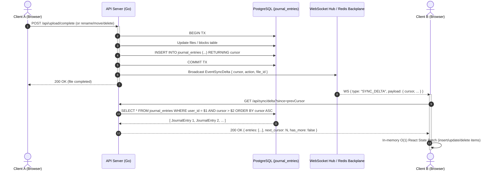

# Phase 2 Walkthrough: Dropbox-Grade Delta Sync Engine

## Overview
In Phase 2, Blob-Cloud has been upgraded with a **Dropbox-Grade Delta Sync Engine**, transforming how file state mutations are propagated from the backend to connected clients. Previously, real-time sync relied on brute-force, full-directory reloads whenever an `UPLOAD_COMPLETED` or file event occurred.

Phase 2 replaces full-page reloading with:
1. An **append-only transaction journal** (`journal_entries`) powered by a 64-bit monotonic cursor.
2. A **Transactional Outbox pattern** where all file mutations (uploads, renames, moves, soft-deletes, restores, and permanent deletions) are atomically logged inside the PostgreSQL database transaction.
3. A **Cursor-based Delta Sync HTTP API** (`GET /api/sync/delta?since=<cursor>&limit=<limit>` and `GET /api/sync/cursor`).
4. An **$O(1)$ Reactive Frontend Sync Engine** in React/TypeScript that patches directory state incrementally without screen flicker and automatically catches up missed events upon reconnecting.

---

## Architecture & Data Flow



---

## Implementation Details

### 1. Database Schema (`000017_journal_entries.up.sql`)
- Created table `journal_entries` with:
  - `cursor BIGSERIAL PRIMARY KEY`: Monotonically increasing 64-bit integer cursor.
  - `user_id VARCHAR(64) NOT NULL`: Scopes delta queries to the file owner.
  - `file_id VARCHAR(64) NOT NULL`: ID of the target file or folder.
  - `action VARCHAR(32) NOT NULL`: One of `FILE_CREATED`, `FILE_UPDATED`, `FILE_DELETED`, `FILE_MOVED`, `FILE_RESTORED`.
  - `parent_id VARCHAR(64)`: Enables client directory filtering.
  - `name VARCHAR(255) NOT NULL`, `is_directory BOOLEAN`, `size_bytes BIGINT`, `mime_type VARCHAR(128)`, `status VARCHAR(32)`, `thumbnail_url TEXT`.
  - `created_at TIMESTAMPTZ DEFAULT NOW()`.
- Composite Index: `idx_journal_user_cursor (user_id, cursor ASC)` ensures $O(\log N)$ range scans for delta sync queries.
- FK Index: `idx_journal_file_id (file_id)`.

### 2. Domain & Repository Layer (`internal/domain/journal.go`, `internal/repository/postgres/journal.go`)
- Defined `JournalEntry` struct, `JournalAction` constants, and `JournalRepository` interface.
- Implemented `JournalRepository`:
  - `Record(ctx, entry) (int64, error)`: Inserts journal entry and returns assigned cursor.
  - `WithTx(tx DBTX)`: Allows journal writes to participate directly in business transactions.
  - `ListSince(ctx, userID, sinceCursor, limit) ([]*JournalEntry, int64, bool, error)`: Efficiently streams up to `limit` entries with lookahead pagination (`limit + 1` query to detect `has_more`).
  - `GetLatestCursor(ctx, userID) (int64, error)`: Fetches current watermark cursor.
- Verified with unit tests in `journal_test.go` verifying monotonic cursor sequencing and pagination.

### 3. Service Layer Integration (`internal/service/`)
- **UploadService (`upload_service.go`)**:
  - Bound `JournalRepository` via `WithJournal()`.
  - Inside `Complete()`, inside the atomic transaction `RunInTx`:
    - If new file: records `ActionFileCreated`.
    - If file exists (new version): records `ActionFileUpdated`.
  - Emits `EventSyncDelta` to the real-time notifier.
- **FileService (`file_service.go`)**:
  - Added `WithJournal()` and `WithNotifier()`.
  - Helper `recordAndNotify(ctx, file, action)` records changes to the journal and triggers `EventSyncDelta` real-time notification.
  - Wired into:
    - `CreateFolder`: records `ActionFileCreated`.
    - `RenameMove`: records `ActionFileMoved` or `ActionFileUpdated`.
    - `SoftDelete`: records `ActionFileDeleted`.
    - `Restore`: records `ActionFileRestored`.
    - `PermanentDelete`: records `ActionFileDeleted`.

### 4. HTTP Transport Layer (`internal/transport/http/`)
- Created `sync_handlers.go`:
  - `GET /api/sync/delta?since=<cursor>&limit=<limit>`: Returns `DeltaSyncResponse { entries, next_cursor, has_more }`.
  - `GET /api/sync/cursor`: Returns `{ cursor: <int64> }`.
- Mounted endpoints on router under `/api/sync` with rate limiting and Bearer token JWT authentication.
- Added comprehensive unit tests in `sync_handlers_test.go` covering unauthenticated (503/401) states and full delta round-trips.

### 5. Frontend Reactive Sync Engine (`frontend/src/`)
- Updated `types/sync.ts`: Added `SYNC_DELTA` event type, `JournalEntry`, `DeltaSyncResponse`, `SyncDeltaPayload`.
- In `Dashboard.tsx`:
  - Maintained `syncCursorRef` tracking the client's current cursor position.
  - Initialized cursor on folder load via `GET /api/sync/cursor`.
  - Implemented `applyDeltaSync()`:
    - Recursively drains pending delta batches from `/api/sync/delta?since=<cursor>`.
    - Patches React `items` state in-memory ($O(1)$ updates, deletions, and moves).
    - Preserves directory alphabetical and folder-first sort order.
  - Replaced full-page reloads in `handleWsMessage` (`SYNC_DELTA`, `UPLOAD_COMPLETED`) and `UPLOAD_COMPLETE_EVENT` with `applyDeltaSync()`.
  - Added **Reconnect Catch-up Sync**: When WebSocket reconnects (`wsStatus` transitions to `CONNECTED`), automatically triggers `applyDeltaSync()` to seamlessly catch up on changes that occurred while disconnected.

---

## Verification & Test Results

### 1. Backend Compilation & Test Suite
```bash
cd backend
go build ./...
# Exit code: 0

go test ./...
# Result: 100% PASS across all packages
# ok  go-drive-clone/cmd/worker-lambda
# ok  go-drive-clone/internal/audit
# ok  go-drive-clone/internal/auth
# ok  go-drive-clone/internal/gc
# ok  go-drive-clone/internal/queue
# ok  go-drive-clone/internal/ratelimit
# ok  go-drive-clone/internal/repository/postgres
# ok  go-drive-clone/internal/service
# ok  go-drive-clone/internal/storage
# ok  go-drive-clone/internal/sync
# ok  go-drive-clone/internal/transport/http
```

### 2. Frontend Type-Check & Production Build
```bash
cd frontend
npx tsc -b
# Exit code: 0

npm run build
# Exit code: 0 (Vite build complete in 13.79s, 436 modules transformed)
```
